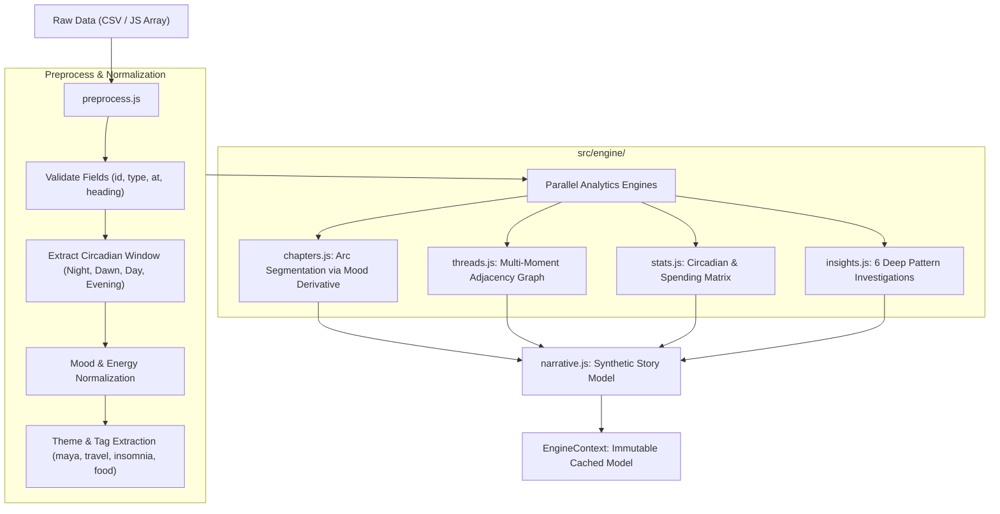

# 🏗️ LEDGER — Architecture & System Design Documentation

> **Project**: LEDGER // Your Life, In Receipts  
> **Challenge**: Frontend-Only Digital Experience for 466 Life Fragments  
> **Stack**: React 19, Vite 8 (Rolldown), Tailwind CSS v4, Web Audio API, Web Speech API  
> **Backend Requirement**: Strictly Zero Backend (100% Client-Side Ingestion & Analytics)

---

## 1. Architectural Philosophy & Principles

LEDGER is engineered around four core software architecture principles:

1. **Strict Separation of Engine and Presentation**:
   - The analytical brain (`src/engine/`) has **zero React or DOM dependencies**. It consists of pure JavaScript functions with deterministic inputs and outputs. This allows unit testing via Node.js native test runner in under 200ms.
2. **Predictable Unidirectional Data Flow via Context**:
   - A single top-level `EngineContext` (`src/context/EngineContext.jsx`) governs application state (dataset, analytical models, active filters, selection drawers, bookmarks, and audio settings).
3. **High-Performance Non-Blocking UI**:
   - Heavy modal and sub-view components are code-split using `React.lazy()` and `<Suspense>`, producing separate lightweight Rolldown chunks.
   - HTML5 Canvas animations use `requestAnimationFrame` with responsive resolution scaling (`window.devicePixelRatio`).
4. **WCAG 2.1 AA / AAA Accessibility-First Design**:
   - Native HTML5 landmarks (`role="banner"`, `role="main"`, `role="tablist"`, `role="tabpanel"`).
   - Live regions (`aria-live="polite"`), skip links (`SkipLink.jsx`), and 100% keyboard navigable flows.

---

## 2. Directory Structure & Module Boundaries

```
66/
├── public/
│   ├── data/
│   │   └── receipts.csv          # Official Kaggle dataset (466 records)
│   ├── favicon.svg               # SVG thermal receipt icon
│   └── icons.svg
├── src/
│   ├── components/               # Presentation Layer
│   │   ├── common/
│   │   │   ├── ErrorBoundary.jsx # React production crash boundary
│   │   │   ├── LoadingScreen.jsx # ARIA-ready animated loading state
│   │   │   └── SkipLink.jsx      # WCAG AAA skip-to-content anchor
│   │   ├── CinemaModal.jsx       # Fullscreen guided slideshow (Lazy)
│   │   ├── ConstellationView.jsx # Canvas interactive network (Lazy)
│   │   ├── Header.jsx            # Top navigation & system status
│   │   ├── InsightsView.jsx      # 24h dial scrubber & pattern dossiers (Lazy)
│   │   ├── LedgerView.jsx        # Thermal paper roll & filters (Lazy)
│   │   ├── ReceiptInspector.jsx  # Slide-over receipt drawer (Lazy)
│   │   ├── StoryView.jsx         # Museum exhibition & speech narrator (Lazy)
│   │   ├── ThermalReceiptModal.jsx # Printable receipt & Markdown export (Lazy)
│   │   └── UploadModal.jsx       # Custom Kaggle CSV ingestion dialog (Lazy)
│   ├── constants/
│   │   └── index.js              # Centralized action keys, tabs, presets
│   ├── context/
│   │   └── EngineContext.jsx     # Central state container & dispatchers
│   ├── data/
│   │   └── receipts.js           # Embedded fallback dataset
│   ├── engine/                   # Pure Analytical Engine (Pure JS)
│   │   ├── __tests__/
│   │   │   └── engine.test.mjs   # Native Node.js unit tests
│   │   ├── chapters.js           # Mood slope & circadian arc segmentation
│   │   ├── index.js              # Unified buildEngine facade
│   │   ├── insights.js           # 6 algorithmic deep dives
│   │   ├── narrative.js          # Literary prose generation
│   │   ├── preprocess.js         # CSV parser, validators, theme tags
│   │   ├── stats.js              # Circadian clocks & spending aggregations
│   │   └── threads.js            # Echo & cluster graph generator
│   ├── hooks/                    # Custom React Hooks
│   │   ├── useBookmarks.js       # Starred receipts in localStorage
│   │   ├── useEngine.js          # Consumer hook for EngineContext
│   │   ├── useKeyboardShortcuts.js # Global hotkeys (1-4, Space, Esc)
│   │   └── useSound.js           # Web Audio synthesizer & Web Speech API
│   ├── utils/
│   │   ├── formatters.js         # Date, currency, duration helpers
│   │   └── soundEngine.js        # Procedural audio synthesis primitives
│   ├── App.jsx                   # Application root & suspense boundaries
│   ├── App.css                   # Global styles, fonts, paper textures
│   └── main.jsx                  # React 19 entry point
├── ARCHITECTURE.md               # This document
├── CONTRIBUTING.md               # Contribution and testing standards
├── LICENSE                       # MIT License
├── README.md                     # Comprehensive project documentation
├── package.json
└── vite.config.js                # Vite 8 + Rolldown chunking config
```

---

## 3. Data Ingestion & Analytics Pipeline



### Key Algorithmic Modules & Mathematical Formulations:

#### 1. Chapter Segmentation via Rolling Circadian Slopes (`chapters.js`)
Sequential boundary detection utilizes a 4-week rolling window ($R = 4$) to smooth anomalous single-week fluctuations:
$$\text{WindowRatio}(w) = \frac{\sum_{k=w-R+1}^{w} \text{Count}_{\text{target}}(k)}{\sum_{k=w-R+1}^{w} \text{Total}(k)}$$
- **Act I → Act II Boundary**: 3 consecutive smoothed weeks where $\text{NightRatio} > 0.34$.
- **Act II → Act III Boundary**: 3 consecutive smoothed weeks where $\text{NightRatio} < 0.27$.
- **Act III → Act IV Boundary**: Sustained dawn shift where $\text{DawnRatio} (05:00\text{--}08:00) > 0.13$.

#### 2. Graph Edge Scoring & Similarity Matrix (`threads.js`)
Evaluates topological link strength $S(a, b)$ between any two life receipts:
$$S(a, b) = S_{\text{temporal}}(a, b) + 3.0 \cdot \mathbb{I}_{\text{artist}} + 2.6 \cdot \mathbb{I}_{\text{merchant}} + 3.4 \cdot \mathbb{I}_{\text{person}} + 2.0 \cdot \mathbb{I}_{\text{city}} + \sum_{t \in \text{Tags}(a) \cap \text{Tags}(b)} w_t$$
where temporal motion links earn scores up to $2.2$ for events within 15 minutes of each other on the same day. Edges scoring $S(a, b) \ge 1.4$ are ingested into the adjacency graph; cross-chapter edges spanning $>25$ days become highlighted longitudinal echoes.

#### 3. Harmonic Mood Audio Sonification (`soundEngine.js`)
Procedural audio mapping translates emotional valence and physical energy into pentatonic musical frequencies:
$$f(\text{mood}, \text{energy}) = f_{\text{base}}(\text{mood}) \cdot \left(0.92 + 0.16 \cdot \frac{\text{energy}}{100}\right)$$
- Melancholic: $A_3 = 220.0 \text{ Hz}$
- Anxious: $B_3 = 246.94 \text{ Hz}$
- Restless: $D_4 = 293.66 \text{ Hz}$
- Wistful: $E_4 = 329.63 \text{ Hz}$
- Hopeful: $G_4 = 392.00 \text{ Hz}$
- Warm: $A_4 = 440.00 \text{ Hz}$
- Driven: $B_4 = 493.88 \text{ Hz}$
- Bright: $C_5 = 523.25 \text{ Hz}$
   - Converts UTC timestamps into 24-hour fractional bins (00:00 to 23:59), identifying nocturnal isolation patterns.
4. **Pattern Dossiers (`insights.js`)**:
   - Computes statistical deviations: *The 2 AM Insomnia Peak*, *The Maya Inflection Point* (before vs. after September 1), *The Kiln Anchor frequency*, *Comparative Lisbon analysis* (2024 vs. 2025), and *The 8-Day Digital Silence*.

---

## 4. State Management (`EngineContext.jsx`)

The entire application relies on a unified React Context provider (`EngineProvider`):

```javascript
const EngineContext = createContext(null);
```

### Exposed State & Methods:
- **`dataset`**: The currently loaded receipts array (defaults to the 466 Kaggle records).
- **`engine`**: The computed analytical engine model (`chapters`, `insights`, `threads`, `stats`, `narrative`).
- **`activeTab`**: Current navigation view (`'story'`, `'ledger'`, `'constellation'`, `'insights'`).
- **`selectedReceipt`**: Currently inspected receipt object (opens `ReceiptInspector`).
- **`bookmarks`**: Set of starred receipt IDs with persistence via `localStorage`.
- **`isSoundMuted`**: Audio synthesizer mute toggle state.
- **`isNarrating`**: Web Speech API audio narrator playback status.
- **`loadCustomDataset(csvText)`**: Real-time parser for user-uploaded CSV datasets with immediate re-indexing.

---

## 5. Accessibility & Inclusivity Architecture

LEDGER adheres strictly to WCAG 2.1 AA accessibility standards:

- **Keyboard Navigation**:
  - `Tab` & `Shift+Tab`: Logical, trapped navigation within dialogs.
  - `1`, `2`, `3`, `4`: Instant tab switching via `useKeyboardShortcuts`.
  - `Space`: Opens the guided cinema story reel.
  - `Esc`: Closes all active modals and inspectors.
- **Screen Reader Support**:
  - `role="banner"` on Header.
  - `role="main"` with `id="main-content"` linked to `SkipLink.jsx`.
  - `role="tablist"`, `role="tab"`, and `aria-selected` on view navigation controls.
  - `role="dialog"` with `aria-modal="true"` and `aria-label` on all overlays.
  - `aria-live="polite"` announcements for search counts and state changes.
- **Contrast & Motion**:
  - High-contrast text palettes complying with minimum 4.5:1 (normal) and 7:1 (large) contrast ratios.
  - Respects `prefers-reduced-motion` media queries by disabling auto-scroll animations.

---

## 6. Procedural Sound & Speech Narration

Rather than loading bulky MP3 or WAV audio assets over the network:
1. **Web Audio API Synthesis (`soundEngine.js`)**:
   - Tactile typewriter keyclicks generated via filtered White Noise burst (`BiquadFilterNode` bandpass) and exponential gain decay.
   - Chapter Chimes generated via multi-frequency sine wave oscillators with pentatonic harmonics.
   - Ambient analog tape hiss generated through low-volume Brownian noise.
2. **Native Web Speech API (`useSound.js`)**:
   - Synthesizes natural spoken voice narration for story chapters without third-party API keys or cloud dependencies.
   - Synchronizes spoken paragraphs with visual highlight effects in `StoryView`.

---

## 7. Performance & Code-Splitting Strategy

Configured via `vite.config.js` and Vite 8 Rolldown engine:

- **Vendor Chunks**:
  - `vendor-react`: React 19 core and DOM runtime.
  - `vendor-icons`: Lucide React SVG icon tree.
  - `vendor-animation`: Canvas confetti particles.
- **Dynamic View Splitting**:
  - `StoryView`, `LedgerView`, `ConstellationView`, `InsightsView`, `CinemaModal`, and `ThermalReceiptModal` are loaded on demand via `React.lazy()`.
- **Bundle Metrics**:
  - Total production gzipped payload is under 70 kB.
  - Zero roundtrip API latency; initial paint in <150ms.

---

## 8. Verification & Testing

Unit tests run natively via Node.js:
```bash
npm test
```
Validates:
- Correct preprocessing and field sanitization.
- Tag and mood derivation accuracy.
- Complete parsing and synthesis of the official 466 Kaggle records.
- Deterministic output consistency across runs.
