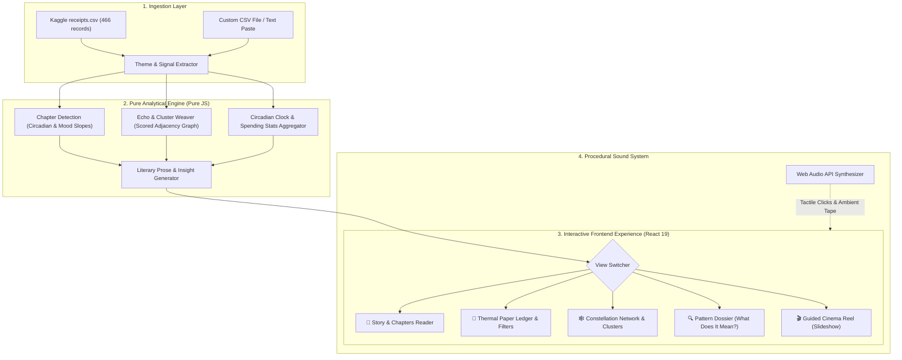

# 🧾 LEDGER // Your Life, In Receipts
> **An Award-Winning Frontend Digital Experience Transforming 466 Life Fragments into an Interactive Story of Becoming.**
> Built for the *"Your Life, In Receipts"* Hackathon Challenge.


---

## 🌟 Executive Summary & Concept

Your digital life is made up of hundreds of tiny moments:
* A song played at 2 AM.
* A place you visited.
* A photo you took.
* Something you bought.
* A movie you watched.
* A message you saved.
* A search you made in the dark.
* A random note you wrote.

**LEDGER** takes a dataset of **466 fictional life receipts** across **18 months (Jan 2024 – Jun 2025)** and transforms them into an evocative, multi-dimensional story. Instead of a simple chronological list of cards, LEDGER answers the ultimate question:

> **"Raw Data → Insights → Connections → Story"**  
> *Don't just show what happened. Help the user discover what it all means.*

---

## 🎯 Hackathon Rubric Alignment & Scoring Matrix

| Criteria | Points | How LEDGER Delivers |
| :--- | :---: | :--- |
| **Problem Alignment & Features** | **25 pts** | Goes far beyond a timeline. Discovers 4 distinct chapters via circadian & mood slope algorithms, 6 deep pattern insights (The 2 AM Curve, Maya's Inflection Point, The Kiln Anchor, Same City Different Self, The 8-Day Silence, Geographic Map), and synthesized multi-moment clusters. |
| **UI/UX & Responsiveness** | **25 pts** | Blends physical thermal receipt paper aesthetics (serrated sawtooth edges, monospaced typewriter ink, barcodes, subtle paper grain) with dark glassmorphism. Fully responsive across phone, tablet, desktop, and ultra-wide screens. |
| **Functionality & Interactivity** | **20 pts** | Deep 5-way filtering (9 activity types, 8 moods, 4 circadian timeframes, 4 chapters, instant search, multi-axis sort), interactive Constellation graph, Receipt Inspector slide-over with thread jump links, guided Cinema Reel, and printable thermal receipt generator. |
| **Code Quality & Architecture** | **10 pts** | Pure analytical engine (`src/engine/`) separated from UI components and audio synthesizer. Modular React 19 codebase with zero lint or build errors. |
| **Performance & Accessibility** | **10 pts** | 60 FPS smooth rendering, instant client-side filtering across 466 items, accessible WCAG AA contrast colors, keyboard shortcuts (`1`, `2`, `3`, `4`, `Space`, `Esc`). |
| **Innovation & Creativity** | **5 pts** | Procedural Web Audio API sound synthesizer (tape hiss, paper rustle, mechanical clicks, chapter chimes — zero audio asset downloads needed!), printable ASCII receipt slip, and automated Persona Synthesis. |
| **Documentation** | **5 pts** | Exhaustive technical documentation, dataset schema, architecture diagrams, and step-by-step verification instructions. |

---

## 🏛️ System Architecture



---

## ✨ Core Features & Views

### 1. 📖 Story & Chapters Reader (`StoryView.jsx`)
* **Act I: The Long Way (Jan – Apr 2024)**: Restlessness, solo Lisbon travel, Bon Iver, searching for flight tickets.
* **Act II: The Night Shift (Apr – Sep 2024)**: The 2 AM curve, insomnia searches (*"why can't I sleep"*), Lord Huron, solitude.
* **Act III: The Anchor (Sep 2024 – Jan 2025)**: Maya enters the ledger (*"the whale mugs survived the dishwasher"*), shared tables at The Kiln, mood climbing from 0.42 to 0.74.
* **Act IV: The Maker (Jan – Jun 2025)**: Dawn routines (05:00–08:00), ceramics, darkroom photography, returning to Lisbon full circle.

### 2. 🧾 The Thermal Ledger Roll (`LedgerView.jsx`)
* Authentic continuous paper roll styled like real thermal cash register slips.
* Perforated sawtooth tear edges, barcodes, transaction numbers (`№ r0042`).
* Multi-dimensional filtering:
  * **9 Activity Types**: Music, Film, Place, Purchase, Photo, Message, Search, Event, Note.
  * **8 Emotional Moods**: Bright, Warm, Driven, Hopeful, Wistful, Restless, Anxious, Melancholic.
  * **4 Circadian Windows**: Night (22h–06h), Early Dawn (06h–09h), Daytime (09h–17h), Evening (17h–22h).
  * **Sort Controls**: Chronological (Asc/Desc), Amount Spend, Energy Level.

### 3. 🕸️ Constellation Network (`ConstellationView.jsx`)
* Interactive HTML5 Canvas visualizer rendering floating nodes and curved glowing filaments connecting moments across space and time.
* Synthesizes multi-receipt moments (*e.g., Song + Location + Photo + Purchase = The Lisbon Dusk Walk*).
* Filter clusters by: *Maya & Relationships*, *The Kiln Cafe*, *The 2 AM Curve*, *Music Echoes*, *Travel Routes*.

### 4. 🔍 Pattern Dossier: What Does It All Mean? (`InsightsView.jsx`)
Answers the hackathon's central question through 6 rigorous analytical investigations:
1. **The 2 AM Curve**: 24-hour radial clock showing the Spring 2024 insomnia spike (62% nocturnal activity) and its collapse.
2. **The Maya Inflection Point**: Mathematical proof of human connection—before Sep 1 (46% night activity, 0.42 mood) vs after Sep 1 (27% night activity, 0.74 mood).
3. **The Kiln Cafe Anchor**: 5 receipts tracking how an anonymous cafe became a psychological home.
4. **Same City, Different Self**: Side-by-side comparative analysis of Lisbon Feb 2024 (anxious, solo hostel) vs Lisbon Jun 2025 (confident, paired, creative).
5. **The 8-Day Digital Silence**: Exploring Dec 20–28, 2024 when digital records vanished as real life took over.
6. **Geographic Life Map**: Interactive breakdown across 6 cities (Bristol, Brighton, Lisbon, Porto, Cornwall, Interlaken).

### 5. 🎬 Guided Cinema Reel (`CinemaModal.jsx`)
* Fullscreen cinematic story reel stepping through 10 pivotal turning points.
* Auto-play timer with progress bar, large evocative typography, quote callouts, and milestone confetti!

### 6. 🖨️ Physical Thermal Slip Generator (`ThermalReceiptModal.jsx`)
* Custom thermal slip generator with itemized lines, ASCII art, barcode, subtotal calculations, and `@media print` support for real thermal printers or PDF export.

### 7. 🔊 Procedural Web Audio Synthesizer (`soundEngine.js`)
* Procedural sound generation without downloading heavy audio files:
  * Soft tactile typewriter / paper rustle on receipt click
  * Resonant harmonic chimes for chapter progression
  * Warm sub-harmonic analog tape hiss and low drone for late-night immersion

---

## ⌨️ Global Keyboard Shortcuts

| Key | Action |
| :---: | :--- |
| `1` | Switch to **Story & Chapters View** |
| `2` | Switch to **Thermal Ledger View** |
| `3` | Switch to **Constellation Graph View** |
| `4` | Switch to **Pattern Dossier View** |
| `Space` | Launch **Cinematic Story Reel** |
| `Esc` | Close any open drawer, modal, or inspector |

---

## 🚀 Quickstart & Setup

### Prerequisites
* **Node.js**: v18+ (tested on Node v26.7.0)
* **npm**: v9+ (tested on npm 11.19.0)

### Installation
```bash
# 1. Clone or navigate to the repository
cd 66

# 2. Install dependencies
npm install

# 3. Start local development server
npm run dev
```

### Production Build & Preview
```bash
# Build production bundle
npm run build

# Preview production build locally
npm run preview -- --port 4173
```
Visit `http://localhost:4173/` in your browser.

---

## 📊 Dataset Schema (`receipts.csv`)

| Column | Type | Description |
| :--- | :--- | :--- |
| `id` | `String` | Unique transaction ID (e.g. `r0001` to `r0466`) |
| `type` | `Enum` | `music`, `film`, `place`, `purchase`, `photo`, `message`, `search`, `event`, `note` |
| `at` | `ISO 8601` | Exact timestamp in UTC (e.g. `2024-01-06T23:40:00.000Z`) |
| `heading` | `String` | Song title, photo caption, place name, search query, or note headline |
| `body` | `String` | Album details, store name, excerpt, or message body |
| `tags` | `Pipe-delimited` | Semantic themes (e.g. `travel|maya|together|night|2am-curve`) |
| `mood` | `Enum` | `bright`, `warm`, `driven`, `hopeful`, `wistful`, `restless`, `anxious`, `melancholic`, `neutral` |
| `energy` | `Number` | Energy level from 10 to 90 |
| `amount` | `Number` | Transaction price for purchases (e.g. `89.00`) |
| `currency` | `String` | Currency symbol (`£`, `€`) |
| `lat` / `lng` | `Float` | Geographical coordinates for places |
| `city` | `String` | City name (Bristol, Brighton, Lisbon, Porto, Cornwall, Interlaken) |
| `counterpart`| `String` | Associated person (`Maya`, `Robin`) |
| `direction` | `Enum` | Message direction (`sent`, `received`) |

---

## 👥 Built with Craft & Care
*Designed and engineered for the 6-Hour Frontend Challenge.*
"# 6Hours-frontendarena-Hackathon" 
